# 🚀 Release Workflow Guide

This document provides a comprehensive guide for managing releases of the Vibe Stats - AI Dev Tools Status Monitor extension.

## 📋 Quick Reference

### Development to Production Pipeline

```
📝 Development → 🧪 Testing → 🔍 Validation → 🚀 Release → 🌐 Chrome Web Store
```

### Current Version: 1.0.4
- **Latest Release**: September 28, 2025
- **Status**: Production Ready
- **Features**: AI dev tools monitoring with cool vibe icons

### Command Cheat Sheet

```bash
# Version Management
npm run version:check       # Check version sync status
npm run version:sync        # Sync package.json to manifest.json
npm run version:set 1.2.3   # Set specific version
npm run version:bump patch  # Bump patch version (1.0.4 → 1.0.5)

# Build & Release
npm run prepare-release     # Validate all files + clean build
npm run release:patch       # GitHub Action patch release
npm run release:minor       # GitHub Action minor release
npm run release:major       # GitHub Action major release

# Development & Testing
npm test                    # Run comprehensive test suite
npm run test:visual         # Visual component validation
npm run build              # Development build
npm run build:clean        # Production build with cleanup
```

## 🔄 Automated Release Process

### Step 1: Trigger GitHub Action

1. **Navigate to GitHub Actions**:
   - Go to your repository on GitHub
   - Click the "Actions" tab
   - Select "Release Build and Deploy"

2. **Configure Release**:
   - Click "Run workflow"
   - Choose version type: `patch` | `minor` | `major`
   - Add optional release notes
   - Click "Run workflow"

### Step 2: GitHub Action Workflow

The automated workflow performs these operations:

```mermaid
graph TD
    A[🚀 Trigger GitHub Action] --> B[📖 Read Current Version]
    B --> C[🔼 Bump Version]
    C --> D[📝 Update Files]
    D --> E[🔍 Validate]
    E --> F[🏗️ Build Extension]
    F --> G[📦 Create Zip]
    G --> H[💾 Commit Changes]
    H --> I[🏷️ Create Git Tag]
    I --> J[📋 Generate Release Notes]
    J --> K[🌐 Create GitHub Release]
    K --> L[📎 Attach Assets]
    L --> M[✅ Complete]
```



### Step 3: Post-Release Actions

After the GitHub Action completes:

1. **Download Release Assets**:
   - Navigate to the new GitHub release
   - Download `vibe-stats-v1.2.3.zip`

2. **Submit to Chrome Web Store**:
   - Go to [Chrome Developer Dashboard](https://chrome.google.com/webstore/devconsole/)
   - Upload the zip file
   - Update store listing if needed
   - Submit for review

## 📊 Version Management

### Semantic Versioning

We follow semantic versioning (semver) principles:

| Type | Version Change | Use Case |
|------|----------------|----------|
| **Patch** | 1.0.0 → 1.0.1 | Bug fixes, small improvements |
| **Minor** | 1.0.0 → 1.1.0 | New features, enhancements |
| **Major** | 1.0.0 → 2.0.0 | Breaking changes, major redesigns |

### Version Sync

The extension maintains version numbers in two files:
- `manifest.json` - Chrome extension manifest (source of truth)
- `package.json` - Node.js package file

**Important**: Always keep these in sync! Use `npm run version:sync` to ensure consistency.

### Manual Version Control

For advanced scenarios, you can manually control versions:

```bash
# Check current status
npm run version:check

# Set specific version (updates both files)
npm run version:set 1.2.3

# Bump versions
npm run version:bump patch  # 1.2.3 → 1.2.4
npm run version:bump minor  # 1.2.3 → 1.3.0
npm run version:bump major  # 1.2.3 → 2.0.0

# Sync package.json to manifest.json
npm run version:sync
```

## 🧪 Pre-Release Testing

### Testing Checklist

Before releasing, ensure all tests pass:

```bash
# 1. Unit and integration tests
npm test

# 2. Visual component validation
npm run test:visual

# 3. Build validation
npm run prepare-release

# 4. Manual testing in browser
# - Load extension in Chrome
# - Test all functionality
# - Verify status updates
# - Check popup interface
```

### Build Validation

The `prepare-release` command runs:
1. File validation (`npm run validate`)
2. Clean build process (`npm run build:clean`)
3. Extension packaging
4. Size and compatibility checks

## 🏷️ Release Types & Examples

### Patch Release (Bug Fixes)
```bash
# Example: Fix popup rendering issue
npm run prepare-release
npm run release:patch
# → Triggers GitHub Action for patch release
```

**When to use**: Bug fixes, typos, minor improvements that don't add features.

### Minor Release (New Features)
```bash
# Example: Add new service monitoring
npm run prepare-release
npm run release:minor
# → Triggers GitHub Action for minor release
```

**When to use**: New features, service additions, UI enhancements.

### Major Release (Breaking Changes)
```bash
# Example: New manifest version, API changes
npm run prepare-release
npm run release:major
# → Triggers GitHub Action for major release
```

**When to use**: Breaking changes, major redesigns, API incompatibilities.

## 📦 Release Assets

### GitHub Release Contents

Each release includes:

```
📦 Release Assets:
├── 📁 vibe-stats-v1.2.3.zip      # Production extension
├── 📄 manifest.json              # Updated manifest
├── 📝 Release notes               # Generated changelog
└── 💬 Chrome Store notes          # Submission guide
```

### Chrome Web Store Submission

The release zip file is ready for direct upload to Chrome Web Store:

1. **Clean Build**: No development files included
2. **Optimized Size**: Compressed and efficient
3. **Manifest V3**: Latest Chrome extension standards
4. **Validated**: All required files present and tested

## 🔧 Advanced Release Scenarios

### Hotfix Release

For urgent bug fixes:

```bash
# Create hotfix from main branch
git checkout main
git pull origin main

# Fix the issue
# ... make necessary changes ...

# Test and release
npm test
npm run prepare-release
npm run release:patch
```

### Feature Release

For planned feature releases:

```bash
# Ensure all features are merged
git checkout main
git pull origin main

# Final testing
npm test
npm run test:visual
npm run prepare-release

# Release
npm run release:minor
```

### Emergency Rollback

If a release has issues:

1. **Immediate**: Revert to previous Chrome Web Store version
2. **Fix**: Create hotfix release with corrected code
3. **Deploy**: Use patch release for quick deployment

## 📊 Release Monitoring

### Post-Release Checklist

After each release:

- [ ] GitHub release created successfully with proper tagging
- [ ] All assets attached and downloadable (zip, manifest)
- [ ] Chrome Web Store submission completed and approved
- [ ] Extension loads correctly in clean browser profile
- [ ] Status monitoring works for Claude AI and GitHub Copilot
- [ ] Cool vibe icons display properly in all states
- [ ] Popup interface functions correctly with both services
- [ ] No console errors in background service worker or popup
- [ ] Version numbers consistent across manifest.json and package.json
- [ ] Privacy policy and documentation updated if needed

### Release Metrics

Monitor these metrics:
- **Build Time**: Should be < 30 seconds
- **Extension Size**: Keep under 5MB for fast downloads
- **Chrome Store Review**: Typically 1-3 business days
- **User Adoption**: Track active users post-release

## 🚨 Troubleshooting

### Common Issues

#### Build Fails
```bash
# Check file validity
npm run validate

# Clear build directory
rm -rf build dist
npm run build
```

#### Version Mismatch
```bash
# Check current versions
npm run version:check

# Sync versions
npm run version:sync
```

#### GitHub Action Fails
1. Check Actions tab for error details
2. Verify required files exist
3. Ensure tests pass locally
4. Check repository permissions

#### Chrome Store Rejection
1. Review Chrome Store policies
2. Check extension permissions
3. Validate manifest.json format
4. Test in clean browser profile

## 📞 Support

For release-related issues:

1. **Build Problems**: Check [BUILD.md](BUILD.md)
2. **Testing Issues**: Review [tests/README.md](tests/README.md)
3. **General Help**: Open GitHub issue
4. **Urgent Issues**: Contact maintainer directly

---

**🔗 Related Documentation**
- [📖 BUILD.md](BUILD.md) - Complete build system guide
- [🧪 tests/README.md](tests/README.md) - Testing documentation
- [📚 README.md](README.md) - Main project documentation